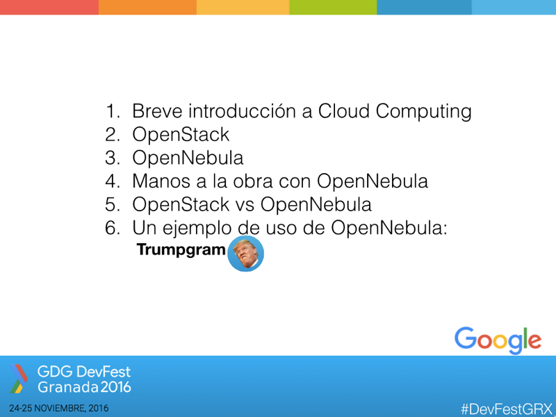
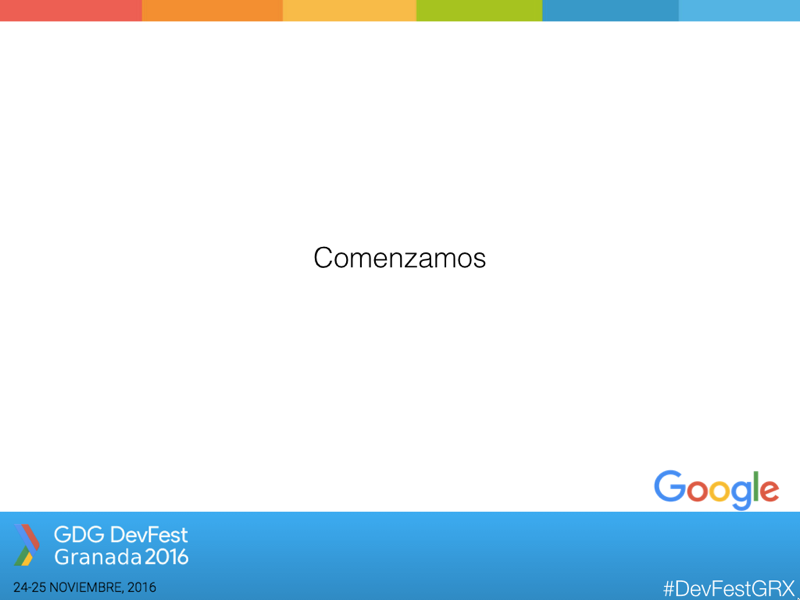
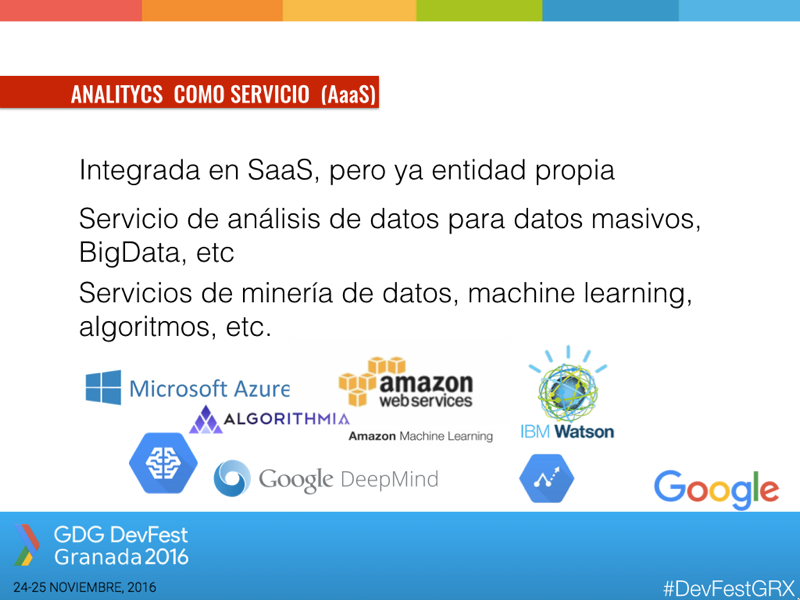
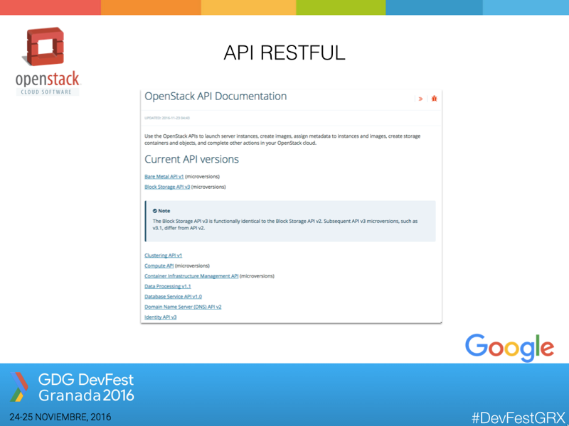
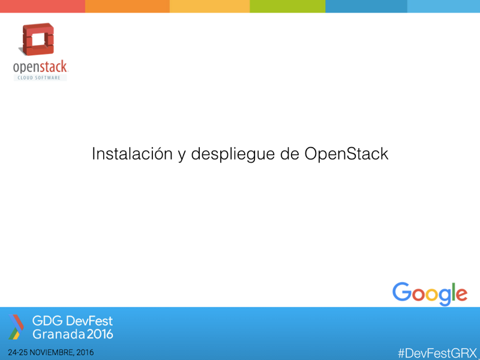

# Google Developer Festival 2016

24-25 de Noviembre 2016, Granada, España.

Aquí está la conferencia divulgativa en Google DevFest sobre cómo crear servicios en la nube utilizando OpenStack y OpenNebula.

Por: Manuel Parra (manuelparra@decsai.ugr.es)

## Contenido:

- Breve introducción a Cloud Computing
- OpenStack
- OpenNebula
- Manos a la obra con OpenNebula
- OpenStack vs OpenNebula
- Un ejemplo de uso de OpenNebula:
 Trumpgram

## Descarga:

Todo el contenido se puede obtener aquí: [Diapositivas HTML](https://github.com/manuparra/cloudcomputing-opennebula-openstack/archive/master.zip) [Diapositivas PDF](https://github.com/manuparra/cloudcomputing-opennebula-openstack/raw/master/imgs/GDG_cloudcomputing_openstack_opennebula.pdf)

## Pantallas:

